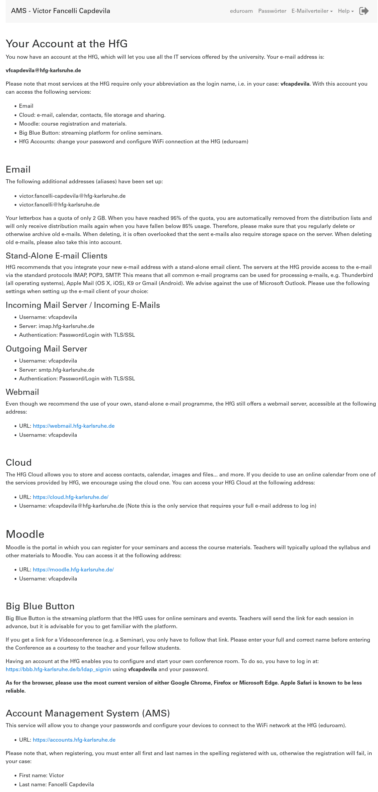
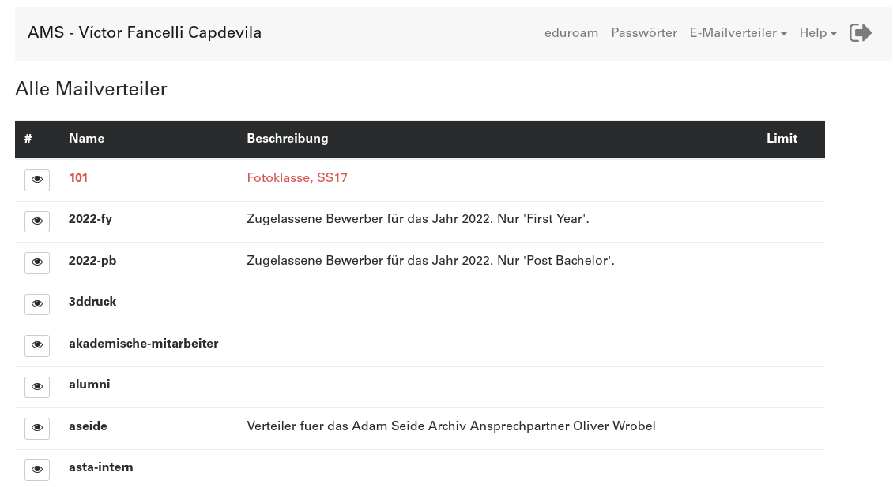

# Getting a HfG Account

The IT Department of the university will create an account for you, that you can use to log-in to all the digital services of the university.

The IT is in Room 3??, in the 3rd floor, on the South-West part of the building. You can also get in contact with them per Email

# Changing the password

You can change your password account in [accounts.hfg-karlsruhe.de](accounts.hfg-karlsruhe.de)
You will find an interface like this:

To log in you need to enter name, family name and your actual password, exactly as introduced when your account was created.

> There may be empty spaces (for double names or family names), as well as accents, umlauts or dash.

## More things in accounts

- An Eduroam Configuration guideline, but you will find it also [here](/eduroam.html)

- The Mailing Lists Manager

