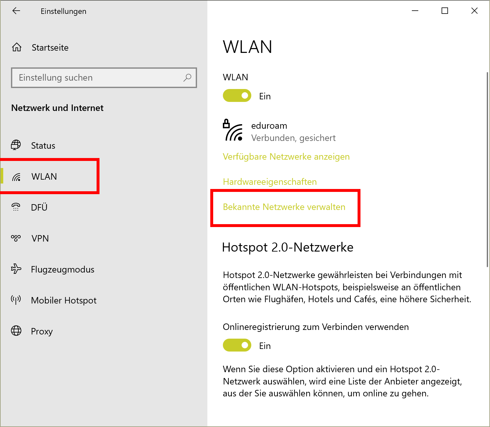
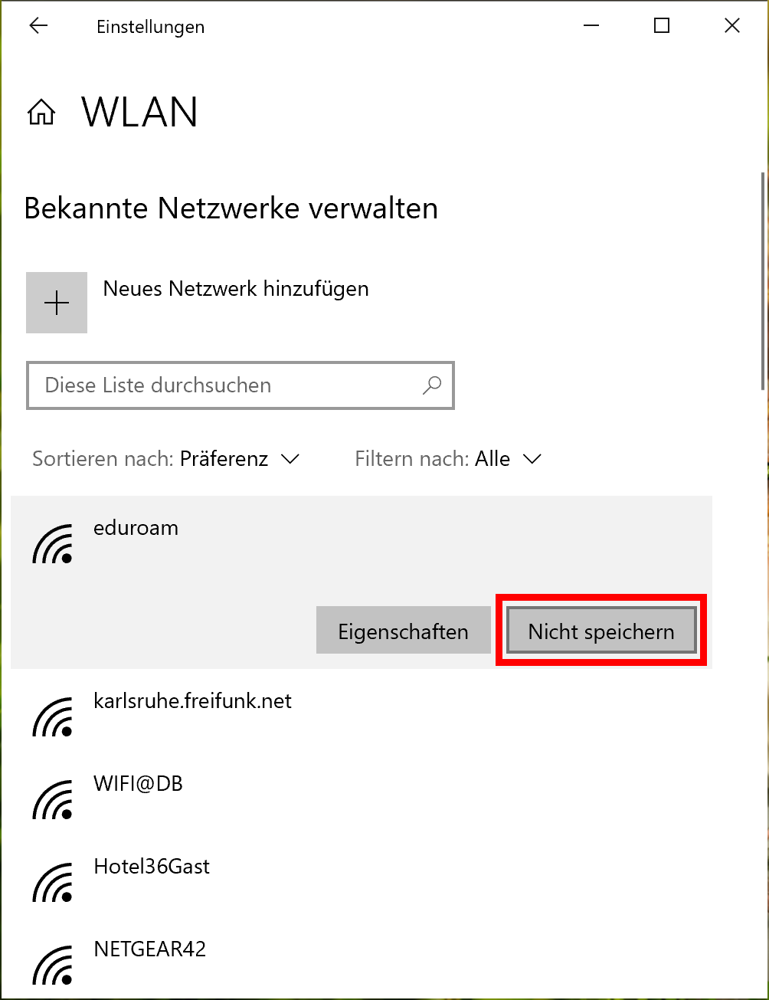
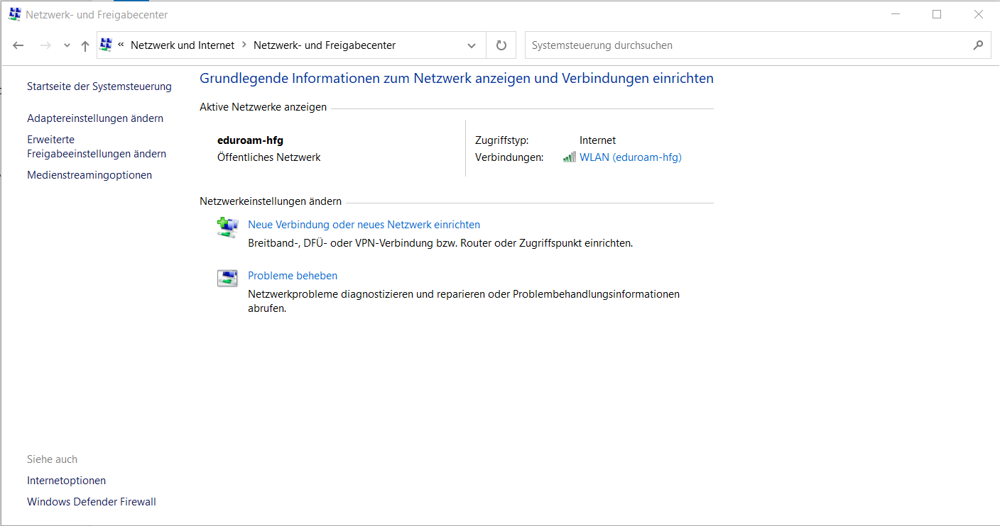
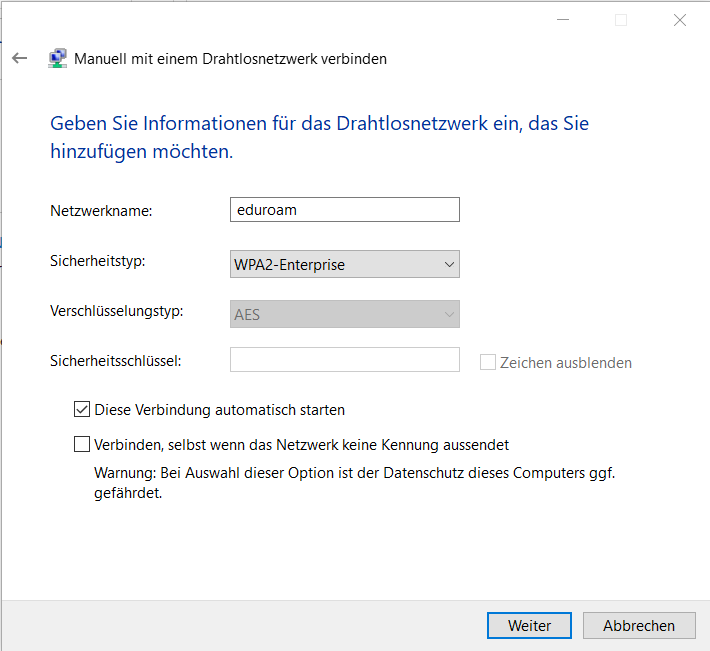
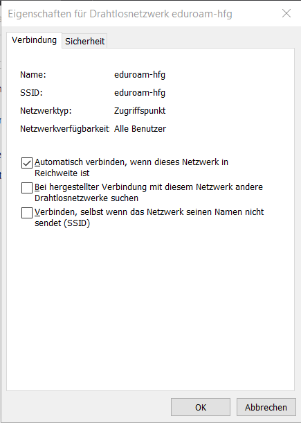
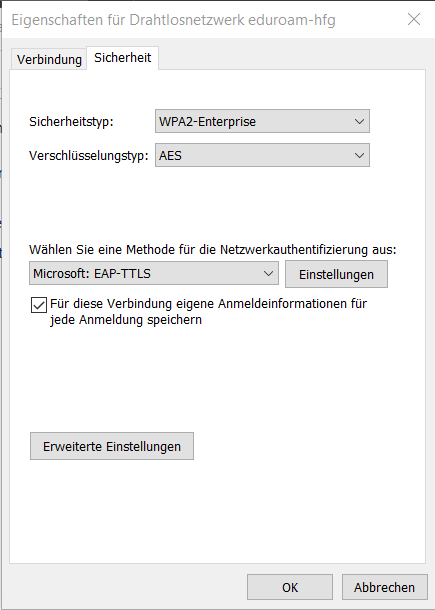
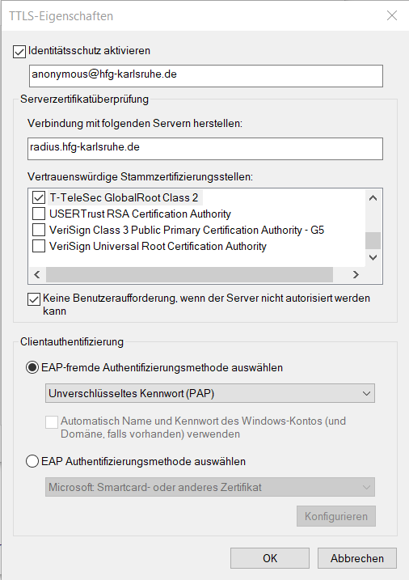
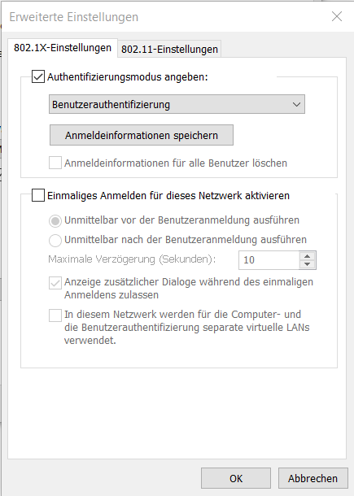
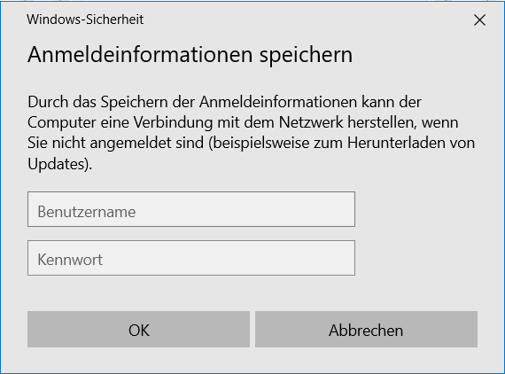
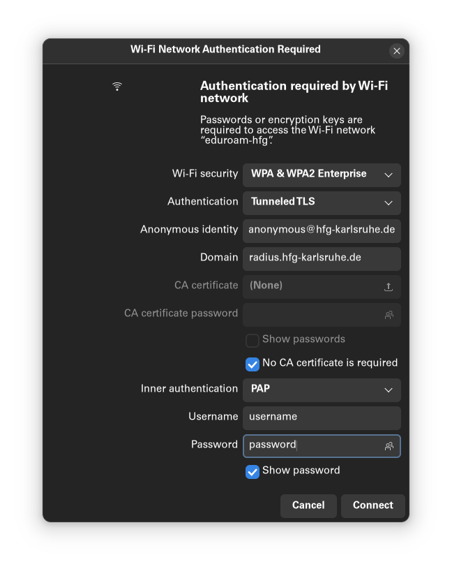

{{page-title}}
# What is eduroam?
According to [eduroam.org](https://eduroam.org/what-is-eduroam/ "Link to eduroam"):

> eduroam (education roaming) is the secure, world-wide roaming access service developed for the international research and education community.  
eduroam allows students, researchers and staff from participating institutions to obtain Internet connectivity across campus and when visiting other participating institutions by simply opening their laptop.

In other words, it's an authentication by which all university members can access Wi-Fi of universities worldwide. So, if you are traveling, you can go to a university (library) and enjoy free (and fast) Wi-Fi.

# eduroam in the HfG

If you are in the building, your device may detect two Wi-Fi connections:

- **eduroam**
- **eduroam-hfg**

The reason for that is that ZKM is also offering an internet connection through eduroam, but some people need to know in which of the networks (HfG or ZKM) they are. Other users in the building may not experience any relevant difference between both networks, as they use the same hardware, offer the same speed, etc.

In short:
> Configure Eduroam (it will allow to connect you inside other institutions). Configure also eduroam-hfg  only if you need to be sure you are connecting to the hfg network.

# Configuring Eduroam
We took the information from [http://accounts.hfg-karlsruhe.de](http://accounts.hfg-karlsruhe.de "Accounts website of the HfG") after login in.

## Apple (macOS, iOS)
You can [download this configuration file](https://accounts.hfg-karlsruhe.de/static/eduroam%20-%20HfG%20Karlsruhe%20-%20signed%20until%202025-05-16.mobileconfig) that will do that for you.

You will need to enter your username and password twice (you will configure both eduroam and eduroam-hfg).

## Windows 10 & 11
 > Windows installation is a bit tricky, but we have this step-by-step guide.

Open the Windows Settings (Einstellungen) of you Computer.

Go to Network and Internet (Netzwerk und Internet) and there to Wi-Fi (WLAN).

When you klick on Managing known Networks (Bekannte Netzwerke verwalten) a list of network names will appear. Klick on eduroam. Then the option forget (nicht speichern) will show. Klick forget (nicht speichern) to delete eduroam. Don't worry, you'll get it back in a second.

On the Windows Menu (or Windows-key), search for Panel Control (Systemsteuerung), and there click on Network and Internet (Netzwerke und Internet). Now you should see something like:

Now click on "Create new connection or new network" (Neue Verbinung oder neues Netzwerk einrichten). This will appear:

Yes, all the options seems quite similar, but you want the third one (establish Manual connection to a wireless network?), and hence we selected it. This will appear:

The name should be "eduroam" or "eduroam-hfg" (no matter if you're using uppercase) and WPA2-Enterprise. Click on next.

Now the tricky part: You will come back to the Panel control and the first link allows us to change the configuration (or something like that). Yes, it makes no sense, Windows: assuming we started a manual configuration, and you didn't give any possibility to configure it… Yes, we want to change the configuration you automatically created. After clicking on the link, something like that should appear (don't worry if your data is different):

Just ignore it and go to the "Security" tab. We can check the first part from our checklist:
- [x] WPA2-Enterprise
- [X] AES
Now select `Microsoft: EAP-TTLS` from the dropdown menu and then click on `Configuration`, which looks like:

Please check that everything is correct

- [ ] Anonymity protection checkbox is activated
- [ ] Anonymity Identity is `anonymous@hfg-karlsruhe.de`
- [ ] Connection to server is set to `radius.hfg-karlsruhe.de`
- [ ] You checked the T-TeleSec Global Root Certificate (you should check in the list)
- [ ] Check also the thing after that
- [ ] Check the EAP-(External?) Authentication method and set to PAP (sometimes this and the next appear to change positions...)

Click on Ok, after the configuration. Small yeah! We still need a couple of things. So, we're back in the Security tab:

and we want to click in Advanced Options:

Here, you want to have the first checkbox activated, and select User-Authentication. Then click on the button after it, "Save Log-in information", this will happen:

- **Login**: your username (everything before @hfg-karlsruhe.de)
- **Password**: the E-Mail password.

Click ok.
Now you can go to the wireless symbol in the bar and try to connect normally. It may ask you again log-in and password, and then it should work.

So, congratulations, now you have internet (almost) everywhere!

### GNU/Linux

Go to the Wi-Fi or Network settings (probably just clicking the Wi-Fi Symbl on the panel, selecting the network and then Wi-Fi settings).

In Security, check this parameters:

| Security | WPA & WPA2 Enterprise |
| Authenticaton | Tunneled TLS |
| Anonymous identity | anonymous@hfg-karlsruhe.de |
| Domain | radius.hfg-karlsruhe.de |
| CA Certificate | (None), click on the checkbox No CA certificate is required |
| Inner authentication | PAP |
| Username | your username (without @hfg-karlsruhe.de) |
| Password | your password |

Here is how it looks on GNOME:

